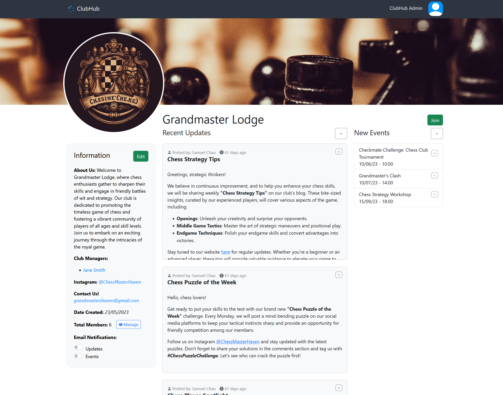

Major Group Project for [Web & Database Computing](https://www.adelaide.edu.au/course-outlines/108960/1/sem-1/) - Semester 1, 2023.
# ClubHub
Immerse yourself in vibrant student life. Find clubs that match your interests, join them, and never miss an update or event. As a Club Manager, share updates, create events, and foster a thriving community. Stay connected, stay informed, and let your campus life flourish with ClubHub!



## Installed Packages
The project uses a variety of npm packages for different purposes. Here are some notable ones:

- **Express**: A web application framework for Node.js.
- **Vue**: A JavaScript framework for building user interfaces.
- **Bootstrap**: A CSS framework for building responsive, mobile-first sites.
- **EJS**: A simple templating language that lets you generate HTML markup with plain JavaScript.
- **Sass**: A CSS pre-processor which allows us to use variables, nested rules, mixins, functions, and more.
- **Nodemon**: A utility that monitors changes in your source code and automatically restarts your server.
- **MySQL**: Node.js drivers for MySQL.
- **Bcrypt**: A library to help in hashing passwords.
- **Passport** and **passport-google-oauth20**: Authentication middleware for Node.js, including Google OAuth 2.0 strategy.
- **Nodemailer**: A module to send emails from Node.js.
- **Webpack**: A static module bundler for modern JavaScript applications.
- **Multer**: A middleware for handling multipart/form-data, which is primarily used for uploading files.
- **Quill**: A powerful, free WYSIWYG editor with a modular architecture.
- **jsdom**: A pure-JavaScript implementation of many web standards, for use with Node.js.
- **dompurify**: A DOM-only, super-fast, uber-tolerant XSS sanitizer for HTML, MathML, and SVG.
- **striptags**: An implementation of PHP's strip_tags in JavaScript.
- **body-parser**: Parse incoming request bodies in middleware before your handlers.
- **cookie-parser**: Parse Cookie header and populate req.cookies with an object keyed by the cookie names.
- **express-session**: Create a session middleware with the given options.
- **express-ejs-layouts**: Layout support for EJS in Express.
- **express-mysql-session**: A MySQL session store for Express.


### Installation

To install all the npm Packages, run:
```
npm install
```

In order to have the latest database version for proper functioning, import it into MySQL. Please note that mysql must be running before hand `service mysql start`. Execute the following command:
```
mysql < database/backups/clubhub-v1.sql
```

## Usage

The following are the npm scripts to run for both the production and development environments.

### Production
- Please note that if running for the first time, npm run dev should be executed first so that the proper files can be compiled for use.
To start the application in a production environment and start the database, run:
```
npm run start
```

### Development

To start the development version of the site, the SCSS and js will be watched. On saving any of the files that are included, all the files will be recompiled. The database will also be started.

To start nodemon and watch Sass, run:

```
npm run dev
```

## Known Issues
We would like to make you aware of the following known issues:

- Multer, the image uploading module, currently encounters an issue when handling some images. Occasionally, users may experience a hang in the image upload process on the site. To resolve this, simply refresh the page and attempt the upload again.

